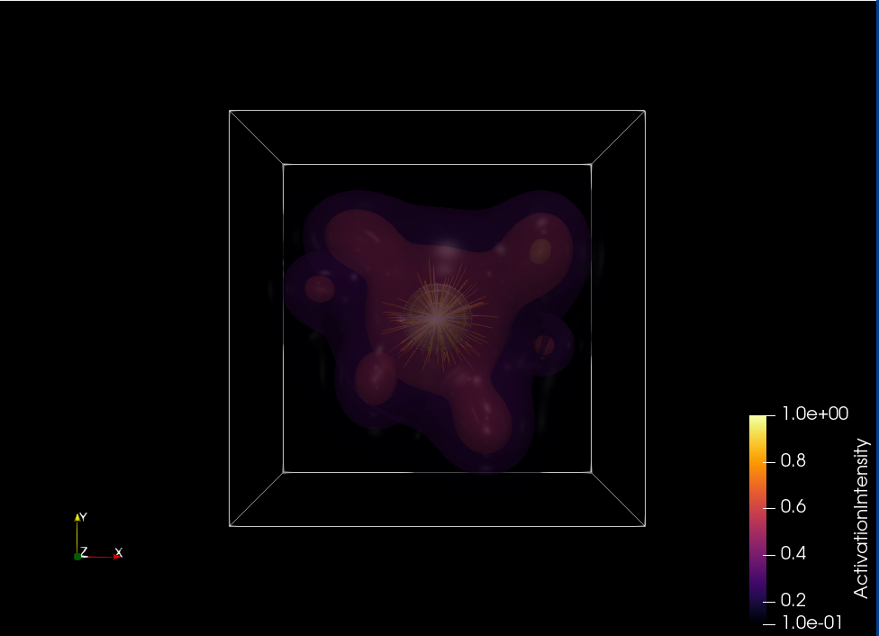
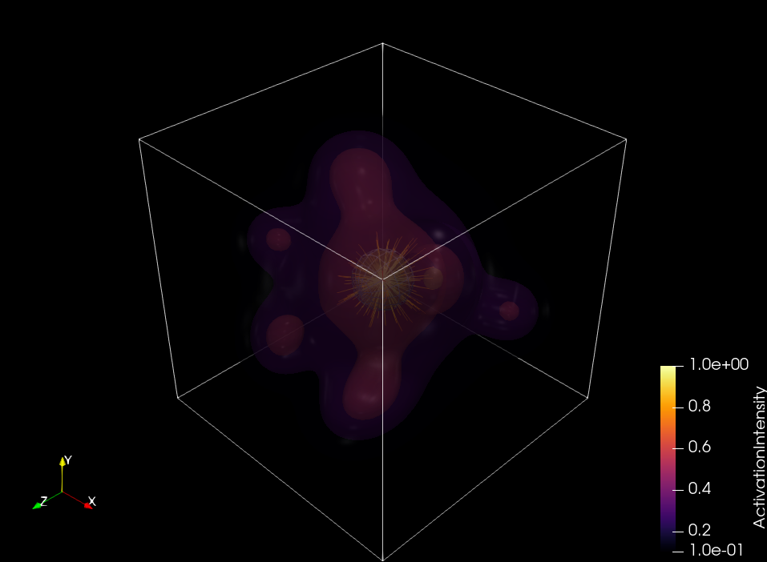
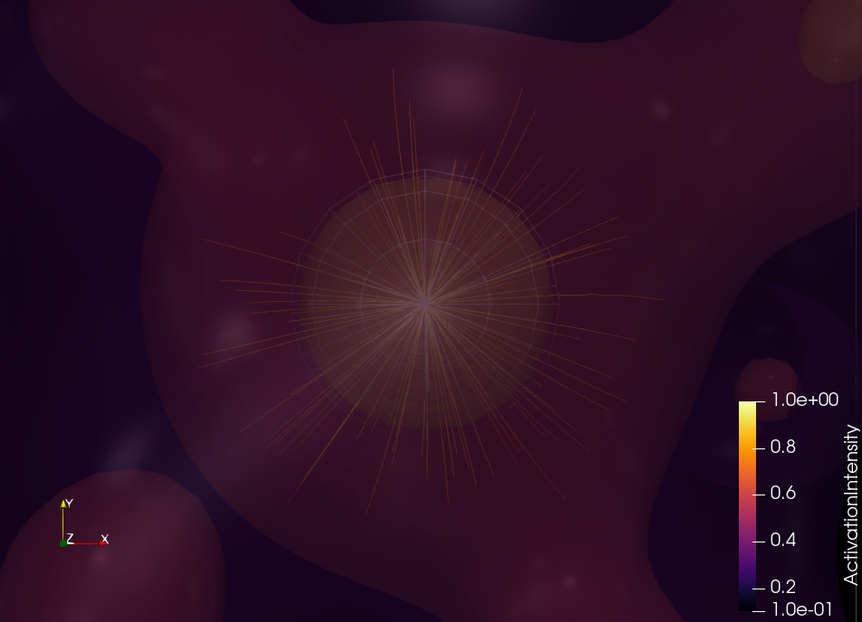

# Neural Activation Volume — 3D Scientific Visualization



A high-fidelity 3D scientific visualization of a synthetic **neural activation field**, built entirely in [ParaView 6.1](https://www.paraview.org/) with a custom Python-generated dataset. This project demonstrates advanced volumetric data visualization techniques applicable to AI research, computational neuroscience, and scientific computing.

---

## Visualization Highlights

| Technique | Description |
|---|---|
| **Multi-threshold Iso-surfaces** | Four nested contour shells at activation levels 0.1, 0.3, 0.6, and 0.9 reveal the hierarchical structure of activation clusters |
| **Transparent layering** | Surface opacity at 0.4 exposes internal geometry, enabling simultaneous visualization of all depth layers |
| **Stream Tracer / Streamlines** | 3D streamlines computed from the activation gradient vector field show directional flow toward peak activation zones |
| **Inferno color mapping** | Perceptually uniform colormap maps activation intensity from deep purple (low) through red to bright yellow (peak) |
| **Custom dataset generation** | Synthetic VTK ImageData (.vti) generated via pvpython with three data arrays: scalar field, vector field, and gradient magnitude |
| **Specular lighting** | Phong specular highlights (0.5) add physical depth cues to iso-surface geometry |

---

## Screenshots

### Hero Shot — Full Activation Field


### Angled View — Depth and Layering


### Core Closeup — Streamline Starburst


---

## Dataset

The dataset is fully synthetic and generated using `generate_neural_activation_v2.py`, which uses ParaView's bundled `pvpython` interpreter. No external dependencies required beyond ParaView itself.

The volume consists of a **64 × 64 × 64 voxel grid** containing three data arrays:

- **`ActivationIntensity`** (scalar) — Sum of seven 3D Gaussian kernels simulating localized neural activation clusters, centered at anatomically distributed positions in a ±3 unit bounding volume.
- **`ActivationGradient`** (vector) — Numerical gradient of the activation field computed via finite differences, representing directional flow toward activation peaks.
- **`GradientMagnitude`** (scalar) — L2 norm of the gradient vector, highlighting activation boundaries and transition zones.

---

## Reproducing This Visualization

### Requirements
- [ParaView 6.1.1](https://www.paraview.org/download/) (Windows/macOS/Linux)
- No additional Python packages needed — uses ParaView's bundled `pvpython`

### Step 1 — Generate the dataset
```bash
# Windows
& "C:\Program Files\ParaView 6.1.1\bin\pvpython.exe" generate_neural_activation_v2.py

# macOS / Linux
/Applications/ParaView-6.1.1.app/Contents/bin/pvpython generate_neural_activation_v2.py
```

This creates `neural_activation.vti` in the current directory.

### Step 2 — Load the ParaView state
1. Open ParaView
2. **File → Load State → `neural_activation_portfolio.pvsm`**
3. When prompted, point it to the `neural_activation.vti` file
4. The full pipeline (Contour + StreamTracer + color maps) loads automatically

### Step 3 — Export
- **File → Save Screenshot** at 3840×2160 for 4K output
- Rotate the viewport freely to explore different perspectives

---

## Pipeline Architecture

```
neural_activation.vti
├── Contour1
│     Isosurfaces: [0.1, 0.3, 0.6, 0.9]
│     Color: ActivationIntensity (Inferno)
│     Opacity: 0.4
│     Specular: 0.5
│
└── StreamTracer1
      Vectors: ActivationGradient
      Seed: Point Cloud (center: 28.5, 28.5, 28.5 | radius: 6.3)
      Points: 100
      Integrator: Runge-Kutta 4-5
      Color: ActivationIntensity (Inferno)
      Line Width: 2
```

---

## Tools & Technologies

- **ParaView 6.1.1** — Visualization pipeline, rendering, screenshot export
- **pvpython** — Scripted dataset generation (VTK ImageData XML format)
- **NumPy** — 3D array computation, Gaussian kernel generation, gradient calculation
- **VTK** (via ParaView) — Contour filter, Stream Tracer, color mapping

---

## About

Created as a scientific visualization work sample demonstrating proficiency in ParaView, 3D scalar/vector field visualization, and reproducible scientific data pipelines.
